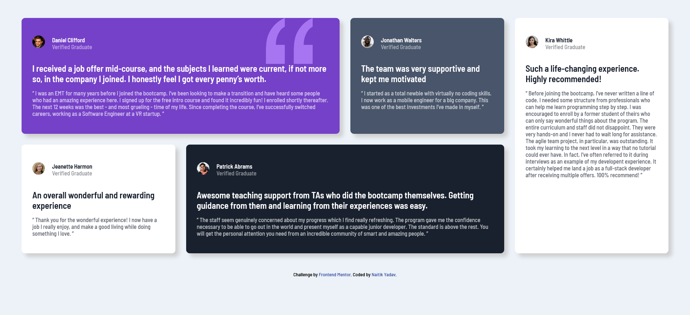

# Frontend Mentor - Testimonials grid section solution

This is a solution to the [Testimonials grid section challenge on Frontend Mentor](https://www.frontendmentor.io/challenges/testimonials-grid-section-Nnw6J7Un7). Frontend Mentor challenges help you improve your coding skills by building realistic projects.

## Table of contents

- [Overview](#overview)
  - [The challenge](#the-challenge)
  - [Screenshots](#screenshots)
  - [Link](#link)
- [My process](#my-process)
  - [Built with](#built-with)
  - [What I learned](#what-i-learned)
  - [Continued development](#continued-development)
- [Author](#author)
- [Acknowledgments](#acknowledgments)

## Overview

### The challenge

Users should be able to:

- View the optimal layout for the site depending on their device's screen size

### Screenshots

### Link

- Live Site URL: [GitHub Pages](https://n4itik.github.io/testimonials-grid-section/)

## My process

### Built with

- Semantic HTML5 markup
- CSS custom properties
- Flexbox
- CSS Grid
- Mobile-first workflow

### What I learned

This project allowed me to learn proper usage of CSS grids and how to interact with grid template areas.

### Continued development

I'd like to take on more complex projects to get even more comfortable with grid layout and flexbox.

## Author

- Frontend Mentor - [@n4itik](https://www.frontendmentor.io/profile/n4itik)
- Linktree - [Naitik Yadav](https://linktr.ee/naitikyadav)

## Acknowledgments

[Learn CSS Grid the easy way](https://www.youtube.com/watch?v=rg7Fvvl3taU)
